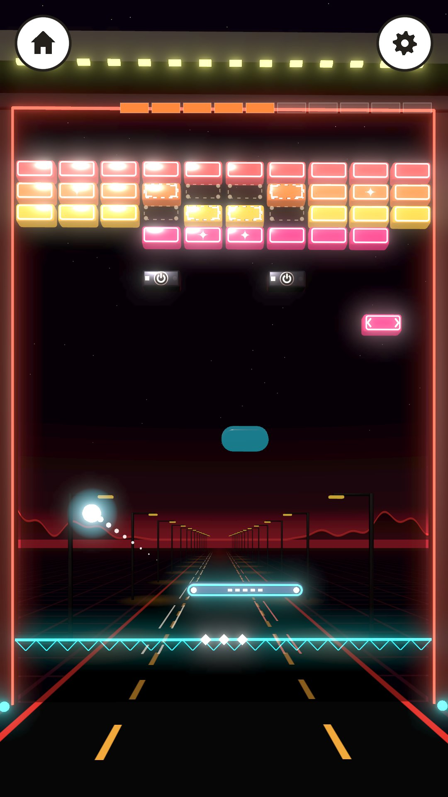
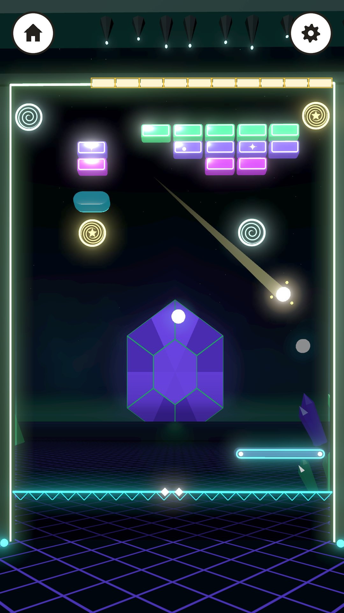
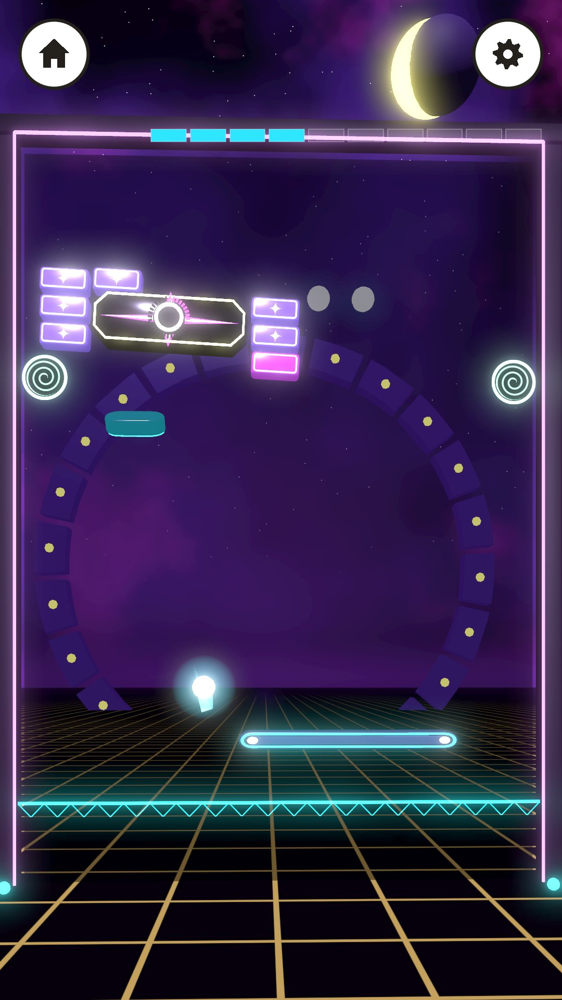

# MWM Neon Bricks

**[⬇ Download the APK (Android, 161 MB)](https://github.com/Matswm86/mwm-neon-bricks/releases/download/latest/mwm-neon-bricks.apk)**

A neon synthwave brick breaker for Android, made for children (ages 4-7 on "Lett", 8+ on "Vanlig"). Steer a glowing paddle with one thumb and bounce a ball through bright 3D bricks on a sunset beach. A safety net under the paddle means a small child never loses. No ads, no tracking, works offline, no Android permissions.

**30 levels in 6 worlds, then endless.** Neonstranda (beach), Rutenettbyen (city), Arkadehallen (arcade), Nattveien (night highway), Krystallgrotta (crystal cave) and Stjerneporten (star gate), five levels each, every world ending in a boss. Bricks: Glass, Double, Triple, Nova, Glider, Chrome, Switch + Ghost, Magnet, portal pairs and march blocks. Power-ups: Komet, Ekko, Bredvinge, Neonpuls, Saktetid and Skjoldnett. After world 1 is cleared, the last map page "Neonveien" opens endless generated levels. Design: `docs/GDD.md` (rules and numbers) and `docs/DESIGN.md` (look).

| Level 1 start | Night highway (world 4) | Crystal cave (world 5) | Star gate boss (world 6) |
|---|---|---|---|
|  |  |  |  |

## Install on a phone or tablet

1. On the device, tap [mwm-neon-bricks.apk](https://github.com/Matswm86/mwm-neon-bricks/releases/download/latest/mwm-neon-bricks.apk) (or open the [latest release](https://github.com/Matswm86/mwm-neon-bricks/releases/tag/latest)).
2. Open the file and allow "Install from this source" if Android asks.
3. If an older build will not update (signature mismatch), uninstall it first.

The APK runs on 64-bit phones and 32-bit tablets (arm64-v8a and armeabi-v7a). It is debug-signed, for sideloading only.

## How to play

- Put a thumb anywhere in the lower part of the screen and slide it: the paddle follows the slide (it never jumps to the finger, so the thumb never covers the ball).
- Lift the thumb to launch the ball, or wait 3 seconds and it launches itself.
- A brick with a star drops a capsule; catch it for a power-up (Komet ploughs through bricks, Ekko splits the ball, Saktetid slows it, and more).
- Clear every brick that glows (chrome and switches never break) to get the star. Hit a switch, or wait, and the dashed ghost bricks swap which set is solid.
- Hold three fingers on the screen for about a second to show the performance readout (fps, draw calls, memory).

## For a host app (MWM Play)

The autoload `NeonBricks` holds the hooks: `set_full_unlock(on)` (default `true`, so the stand-alone build has every level open), `set_difficulty(easy)`, `set_shell_inset(inset)`, `set_sfx_on`, `set_music_on`, `set_haptics_on`, `set_less_motion`, `save_game()`, and the signals `level_card_shown(level_id)` and `free_levels_finished()`. With `Engine.set_meta(&"mwm_play_shell", true)` the game hides its own home disc and settings gear and leaves the back button to the host. Save file: `user://neon_bricks_save.json`.

## Development

- Godot 4.6, `mobile` renderer, portrait 1080x1920. APKs are built by GitHub Actions on every push to `main`.
- Logic test (net, gentle restart, bot clears world 1, flash limiter, save): `godot --headless --audio-driver Dummy res://tests/net_test.tscn`
- Level test (bot clears all 30 levels in both settings, pacing, ghost / portal / magnet / march logs, endless generator, flash limiter in the game loop): `godot --headless --audio-driver Dummy res://tests/levels_test.tscn` (about 10 minutes; `LEVELS_ONLY=<id>`, `LEVELS_SEEDS=<n>`)
- Screenshot bot: `tests/capture.tscn` (phases `shots`, `inset`, `tall`, `shell`, `action`, `worlds`; see the header of `tests/capture.gd`).
- Pacing reference: `python3 tools/action_sim.py` (Python sim the levels were designed with).
- Lint: `gdlint scripts tests` and `gdformat --check scripts tests`.

Credits and licences: `CREDITS.md`. Font: Fredoka (SIL OFL 1.1, `assets/fonts/Fredoka-OFL.txt`).
